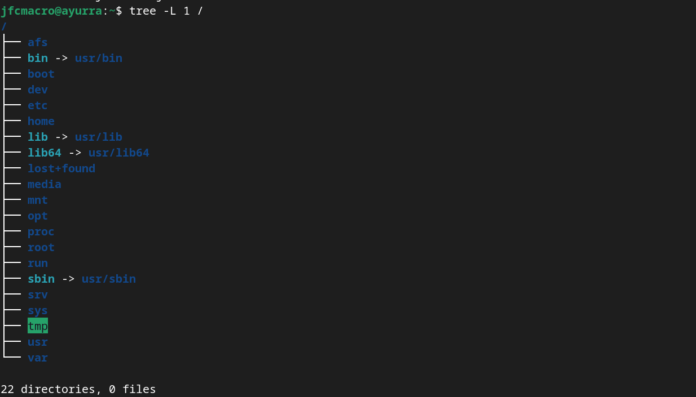

# Sistemas Operativos - Taller 2 - El mundo según C, C++, Interpretador de comandos y conceptos de sistemas operativos

## Agenda

1. Preliminares 
2. El mundo según C, C++ y otros
3. Llamadas al sistema
4. Estructura de directorios
5. Interpretador de comandos

## Preliminar

Abra una terminal. Abra el directorio de repositorio y de los talleres

```
cd <repositorio-enlace>
cd talleres
```

Descargue el taller en formato zip, descomprimalo.

```
wget https://github.com/jfcmacro/TallerSO_02/archive/refs/heads/master.zip
unzip master.zip
rm master.zip
```

Mire la estructura actual

```
tree .
```

Entre al directorio del taller

```
cd TallerSO_02-master
```

Adicione los ficheros

```bash
git add README.md .gitignore
```

Adicione los ficheros del proyecto, esto adiciona todos ficheros del taller.

```bash
find . -name *.c -exec git add {} \;
find . -name makefile -exec git add {} \;
```

Acometa (*commit*) el proyecto.

```
git commit -m "Iniciando el Taller 02"
git push
```

## El mundo según C, C++ y otros

Para cada ejercicio tenga en cuenta que los ejercicios están diseñados para Windows o para Linux (MacOS o WSL), en el caso de Windows abra una terminal de `msys2`, en Linux (y otros) abra una terminal que tenga el `bash` como *shell*.

### Introducción

Programar consiste en crear una implementación de una solución, lo suficientemente genérica para que a través de parámetros, se puede cambiar el comportamiento de dicha solución, sin tener que cambiar el código.

Normalmente, esto lo observamos la declaración de funciones, que reciben parámetros que le permiten modificar consistente la solución, por ejemplo tememos una función de ordenamiento (`sort`), que además de recibir en un argumento los datos a ordenar, puede tener recibir un parámetro que representa la función de comparación. Esto parámetros, hacen que el ordenamiento se pueda hace utilizando diferentes criterios, sin tener que modificar el programa.

En la programación actual, se requiere construir programas que implementen la solución más general y que a través de los parámetros se pueda cambiar su comportamiento. En el caso de los programas y los guiones, esto se puede lograr a través de los argumentos de la línea de comandos o las variables de ambiente.

Vamos a ver como hacerlo a través de Linux y Windows y en el camino como aprenderlo hacerlo utilizando el lenguaje de programación C.

### Línea de argumentos

Un programa se convierte en un proceso cuando este es lanzada o ejecutado, en dicho momento se convierte en un **proceso**. Normalmente, lo podemos hacer a través de la interfaz gráfica dando un doble clic en icono que representa el fichero y esta asociado al ejecutable, o dicho icono representa al ejecutable mismo. 

En la consola esto se hace escribiendo un comando que puede ser un comando interno del *shell* que representa una acción o este comando es el nombre de un ejecutable.

El siguiente formato es la línea de argumentos, que es utilizado para lanzar un programa con los argumento que pueden cambiar el comportamiento del programa.

```bash
<comando o nombre-ejecutable> [<argumentos>]...
```

#### Linux

Un programa tiene un comportamiento definido por su código, este comportamiento puede cambiar con la iteración del mundo exterior, ya sea a través de las operaciones de entrada y salida, línea de argumentos y variables de ambiente.

La línea de argumentos permite pasar elementos que cambien el comportamiento de un programa, por ejemplo algunos programas puede recibir una argumento que indique el orden que van a ser ordenado los resultados. 

##### [Línea de Argumentos](./argumentos/linux/argumentos.c)

Se encarga de mostrar como un programa recibe argumentos del mundo exterior, a través del `shell` y mostrar cada uno de los argumentos.

**Ejercicio 1**. [Compilar `argumentos.c`]. El compilador instalado es `gcc`.

La siguiente líneas nos permite ejecutar dos tareas. Mover a un directorio (`cd`) y compilar un programa (`gcc`). Ejecute la siguiente líneas en la terminal:

```bash
cd argumentos/linux/
gcc argumentos.c
```

El primero (`cd`) es un **inner command**, este es ejecutado internamente por el `shell` (`bash`), no es programa en ejecución. Este comando recibe un argumento el nombre de la ruta del directorio de trabajo (**pathname**).

El segundo (`gcc`) es la ejecución de programa con un argumento `argumentos.c`, este es un programa real:

```bash
which gcc
```

Muestra la ruta donde está ubicado el ejecutable `gcc`.

La ejecución anterior generar un ejecutable llamado `a.out`. Para ejecutarlo:

```bash
./a.out
```

Esto muestra que el programa recibe un solo argumento que es el nombre el programa que se esta ejecutando.

Ejecute con varios argumentos:

```bash
./a.out arg1 arg2 arg3 "varios argumentos" /tmp/fichero ../fichero2
```

Así se pueden pasar varios argumentos al programa y cada argumento puede ser utilizado para definir un comando, una acción, un fichero (o ficheros), todo dependerá de la forma que el programado defina el comportamiento del comando.

**Ejercicio 2.** [Dar un nombre al ejecutable]. El nombre `a.out` puede ser confuso para determinar cual es el propósito de un programa, algunos ejecutables tiene nombres que sugiere su tarea por ejemplo: `sort` un programa que ordena; `ls` listar directorios, `pwd` (Process Working Directory). Nosotros podemos nombrar los ejecutables a traves de una opción (línea de argumento del compilador).

```bash
gcc -o argumentos argumentos.c
```

Observe el fichero creado:

```bash
ls -l
```

Se ha creado un fichero llamado `argumentos`.

##### [Manejo de argumentos](./argumentos/linux/manejo_argumentos.c)

Los argumentos puede ser opcionales, obligatorios, tener valor. El manejo manual de la línea de argumentos puede se un poco complicado, para ello existe una biblioteca (ustedes llaman librería) que se encarga de procesar la línea de argumentos, esta es la biblioteca [`getpopt`](https://man7.org/linux/man-pages/man3/getopt.3.html).

Observe que el programa es capaz de procesar dos conjuntos de argumentos:

```bash
./manejo_argumentos -h
```

Esto muestra dos conjuntos: el primero `-h` y el segundo `-c -g -p <nombre_impresora>`. Son dos conjuntos disyuntos, esto se logra a través de la programación. Ya vimos como funciona el primer conjunto. El segundo puede aceptar cero,  uno, dos o tres argumentos:

```bash
./manejo_argumento
./manejo_argumento -c
./manejo_argumento -c -g
./manejo_argumento -g -c -p "impresora"
```

**Tarea 1.** "Saludo o despedida" [directorio: `ambiente/linux` fichero: "saludo.c", conjunto argumentos 1: "[-s|-d] <nombre>", conjunto argumentos 2: "-h"]. El programa `saludo` en el primer conjunto recibe un nombre y saluda a dicho nombre, si la opción `-d` esta activa se despide de la persona.

[Ejecución]
```bash
./saludo -h
```
[Salida]
```bash
Uso: ./salida -h
     ./salida [-s|-d] <nombre>
```

[Ejecución]
```bash
./saludo juan
```
[Salida]
```bash
Hola juan
```

[Ejecución]
```bash
./saludo -s juan
```
[Salida]
```bash
Hola juan
```

[Ejecución]

```bash
./saludo -d juan
```
[Salida]
```bash
Adios juan
```

#### Windows

El comportamiento de un programa es a través de la línea de comandos.

##### [Linea de Argumentos](./argumentos/windows/argumentos.c)

Se encarga de mostrar como un programa recibe argumentos del mundo exterior, a través del Shell y de la línea de comandos.

**Ejercicio 3**. [Compilar `argumentos.c`]. El compilador instalado es `gcc`.

```bash
cd argumentos/windows
gcc -o argumentos argumentos.c
```

Observe el ejecutable:

```bash
ls
```

Ejecutelo:

```bash
./argumentos.exe
```

##### [Manejo de argumentos](./argumentos/windows/manejo_argumentos.c)

Los argumentos puede ser opcionales o tener variables, hacerlo de manera manual es un poco complicado, vamos a utilizar una biblioteca `getpopt`.

**Ejercicio 4**. [Compilar y ejecutar]. Modifique el programa para que acepte las mismas opciones que su primo en linux.

**Tarea 2**: "Saludo o despedida" [directorio: `ambiente/windows` fichero: "saludo.c", conjunto argumentos 1: "[-s|-d] <nombre>", conjunto argumentos 2: "-h"]. El programa `saludo` en el primer conjunto recibe un nombre y saluda a dicho nombre, si la opción `-d` esta activa se despide de la persona.

**Ejercicio 5.** ¿Por qué los programas de las **Tarea1** y **Tarea2** son idénticos, si están en sistemas operativos diferentes?

### Variables de ambiente

Ya vimos que las línea de comando pueden cambiar el comportamiento de un programa. Pero existe otra maneras de cambiar el comportamiento del programa a través de otro mecanismo llamado variables de ambiente. Una variable de ambiente es un para donde se tiene una clave (o nombre) y un valor para dicha clave. Estas variables de ambiente se define dentro del *shell* que lanza el programa

#### Linux

##### [Mostrar las variables de ambiente](./ambiente/linux/ambiente.c)

**Ejercicio 6** [Compilar `ambiente.c`, ficheros: `ambiente.c` , `Makefile`] Ya hemos visto como compilar un programa de forma directa, pero esta es una tarea repetitiva. Normalmente, nosotros estamos habituados a utilizar un IDE para hace que este lo haga de forma automática. Aunque los IDEs son excelente herramientas, muchos de ellos utilizan una tecnología que permite esta compilación automática. Este es la herramienta `make`. En este punto el profesor va a introducir esta herramienta. Una vez terminada la introducción al `make` implemente su propio fichero `Makefile`  y  compile este proyecto. Y ejecute el programa, y mire las variables definidas. Utilize su AI favorita para preguntar que significa cada una de esas variables.

**Ejercicio 7** [Ejecutar `ambiente`] Las variables de ambiente puede ser definidas en cualquier cualquier momento.

```bash
export VARIABLE1="Este es un valor 1"
export VARIABLE2="Este es un valor 2"
./ambiente
```

Defina variables de ambiente y miren como son definidas en el programa.

##### [Mostrar una variable de ambiente en particular](./ambiente/linux/variable.c)

**Ejercicio 8** [Compilar `variable.c`, ficheros: `variable.c`, `Makefile`]. Modifique el `Makefile` modificado en el ejercicio anterior y añada otro objetivo que compile el programa `variable.c`.

**Ejercicio 9** [Definir y verificar variables de ambiente]. Defina sus propias variables de ambiente:

```bash
export MIVAR=<valor>
```

Y mire el contenido de la misma

#### Windows

##### [Mostrar las variables de ambiente](./ambiente/windows/ambiente.c)

**Ejercicio 10** [Compilar `ambiente.c`, ficheros: `ambiente.c`, `Makefile`]. Compilar el programa `ambiente.c` por medio del `make`. Y ejecute el programa, y mire las variables definidas. Utilize su AI favorita para preguntar que significa cada una de esas variables.

**Ejercicio 11** [Definir las variables]. En Windows estamos utilizando una terminal de [msys2](https://www.msys2.org/), las variables son definidas de la misma forma que en linux. En este ejercicio abramos una terminal diferente, en Windows Terminal miramos las opciones y abrimos la terminal basada en `cmd`. En ella las variables se define diferente.

```bash
%MIVAR%=<valor>
```

Defina varias variables y vean el valor definido en ellas.

[Mostrar una variable de ambiente en particular](./ambiente/windows/variable.c)

**Ejercicio 12** [Compilar `variable.c` ficheros: `variable.c`, `Makefile`]. Añadir al fichero `Makefile` el objetivo de compilar `variable.c`

**Ejercicio 13** [Definir variables y mostralas]. El ejercicio consiste que defina variables en una terminal [msys2](https://www.msys2.org/), defina variables en una terminal `cmd`. Mire como son mostradas.


### Errores

Los errores surgen por diferentes razones, y los programas deben identificarla y manejarla según el contexto del programa. Usualmente, esto se maneja a través de las excepciones, en particular en el bloque `try`-`catch` (`try`-`except`). A diferencia de los lenguajes de programación, los sistemas operativos están basados en llamadas al sistema y estás retorna un código de error que debe ser entendido y manejado.

#### Mejoras al `makefile`

Observe al siguiente [`makefile`](./manejo-errores/linux/makefile).

* Manejo de dependencias (`$<`) y objetivos (`$@`).
* Variables predefinidas de compiladores: `${CC}`, `${CXX}`

#### Unix (Linux)

Gran parte de las llamadas al sistema utilizan hacen que la función devuelva en la información de estado no solamente una manija, sino también un código de error.

* [Generación de error](./manejo-errores/linux/error.c): Este programa como funciona la captura de errores.

Ir a la carpeta del taller:

```bash
cd <repositorio-enlace>
cd talleres/TallerSO_02-master/manejo-errores/linux
```

Compile:

```bash
make error
```

Ejecute:

```bash
./error
```

Esto muestra un código de error, investigue el código de error

```bash
errno 2
```

El comando `errno` permite ver el tipo de error, nos permite ver la información de todos los errores

```bash
errno -l
```

* [Obtener información de error](./manejo-errores/linux/obtener_error.c): Utiliza la función `perror` para identificar al error

Compile:

```bash
make obtener_error
```

Ejecute:

```bash
./obtener_error
```

* [Recuperar el error](./manejo-errores/linux/recuperar_errror.c): Una vez que ocurre un error este debe ser recuperador.

Compile:

```bash
make recuperar_error
```

Ejecute:

```bash
./recuperar_error
```

[**Ejercicio**] El programa anterior `recuperar_error.c` tiene un error en la concepción y es que este programa repite varia veces el mismo código, copie el programa con el nombre `recuperar_error_2.` de forma que no repita le mismo código a través de funciones.

#### Windows

Gran parte de las llamadas al sistema utilizan hacen que la función devuelva en la información de estado no solamente una manija, sino también un código de error.

* [Generación de error](./manejo-errores/windows/error.c): Este programa como funciona la captura de errores.

Ir a la carpeta del taller:

```bash
cd <repositorio-enlace>
cd talleres/TallerSO_02-master/manejo-errores/windows
```

Compile:

```bash
make error
```

Ejecute:

```bash
./error
```

Esto muestra un código de error, investigue el código de error. En la página de aprendizaje de [microsoft](https://learn.microsoft.com/en-us/windows/win32/debug/system-error-codes--0-499-). En la plataforma [Learn Microsoft](https://learn.microsoft.com/en-us/)

* [Obtener información de error](./manejo-errores/windows/obtener_error.c): Utiliza la función `perror` para identificar al error

Compile:

```bash
make obtener_error
```

Ejecute:

```bash
./obtener_error
```

## Llamadas al sistema

### Unix (Linux)

#### Conceptos

[Mostrar Poema con llamadas al sistema a través de `libc`](./llamadas-al-sistema/linux/mostrar_poema.c). Mostrar el contenido de un fichero, como lo hace el comando `cat`.

* Manual.
* Descriptores de ficheros (`fd`). Manijas.

[**Ejercicio**] A partir del [`mostrar_poema.c`](./llamadas-al-sistema/linux/mostrar_poema.c), crear un programa llamado `mostrar.c` que recibe a través de la línea de comando una lista de ficheros de texto, y mostrar cada uno de ellos.

Ejemplo: 

```bash
./mostrar fichero1.txt fichero2.txt fichero3.txt
```

La salida se vería así:

```bash
Contenido fichero 1
Contenido fichero 1
Contenido fichero 2
Contenido fichero 2
Contenido fichero 2
Contenido fichero 3
Contenido fichero 3
```

[Mostrar Poema con llamada al sistema directamente](./llamadas-al-sistema/linux/mostrar_poema_syscall.c). Mostrar el contenido de un fichero, como lo hace el comando `cat` con `syscall(2)`

* Parámetros variables

### Windows

#### Conceptos

[Mostrar Poema con llamadas al sistema del sub-entorno WinRT](./llamadas-al-sistema/windows/mostrar_poema.c). Mostrar el contenido de un fichero, como lo hace el comando `cat`.

* Manual.
* Manijas (`HANDLES`)

[**Ejercicio**] A partir del [`mostrar_poema.c`](./llamadas-al-sistema/windows/mostrar_poema.c), crear un programa llamado `mostrar.c` que recibe a través de la línea de comando una lista de ficheros de texto, y mostrar cada uno de ellos.

## Estructura de directorios

### Linux



### Windows

## Interpretador de comandos

### Comandos vistos en anteriormente

* `echo`
* `ls`
* `cat`
* `wc`

### Sistema de ayuda interactiva

* `man`
* [Man online](https://man7.org/linux/man-pages/)
* `zeal`
* [DevDocs](https://devdocs.io/)

### Directorio de trabajo

Abra una terminal. 

Ejecute el siguiente comando

```bash
pwd
```

Este comando muestra el directorio de trabajo actual.

Muestre el contenido del directorio

```bash
ls -la
```

Debe haber varios directorios especiales, en particular dos:  `.` directorio de actual, `..` padre

Cambie directorio al directorio padre.

```bash
cd ..
```

Mire la estructura de directorios.

```
tree .
```

Revise el manual `man tree` y pruebe varias opciones.

Mire el contenido del directorio con el comando `ls`. Revise el manual `man ls` y pruebe varias opciones.

Muévase al directorio de raíz:

```bash
cd /
```

Mire la estructura de directorios con `tree` y pruebe varias opciones.

Hay varias formas de volver al directorio del usuario: `cd $HOME`, `cd ~`, `cd`. 

### Manipulando ficheros

* `cp`: Copia un fichero a otro
* `mkdir`: Crea un directorio
* `mv`: Renombrar o mover un fichero
* `ln`: Enlazar un fichero
* `rmdir`: Borrar un directorio
* `rm`: Borrar un fichero

### Comandos básicos

* `head`
* `cut`
* `grep`
* `sort`
* `uniq`
* `man`

### Ejecución de programa

* Estructura de la línea de comandos:
  * Comandos
  * Opciones
  * Argumentos
* Comandos
  * Programas. Todo ejecutable, con la ruta de camino o que se encuentre en la variable `$PATH` y que se tenga permisos, puede ser ejecutada
  * Ordenes internas
* Opciones
* Argumentos
  * Variables
  * Salida de otros programas como argumentos

### Información del estado del sistema

* `who`: 
* `ps`
* `top`


